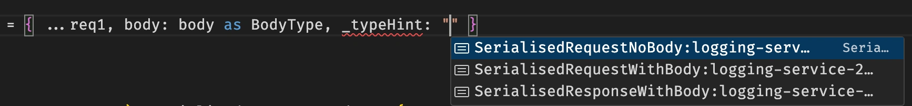

# Adding type hints

Just in case anyone else is rolling their own on-prem log analysis; one thing you'll run up against, is that you'll need to know the types used if all the logs go to the same central location and you find you need a hint of where to look (what project, etc) for the schema ie. types, I've come up with what I think is a very pragmatic way to add _typeHint fields to logged data; 

## **How it works**

1. The basic idea is you have a version file with something like this in it;

```ts.numbered
// version.ts
export const ver = "1.1"
export const SERVICE_NAME = `logging-service-2024-${ver}`
```

and you then define your type hints as follows

```ts.numbered
// types.d.ts
export type SerialiseTypes =
    `SerialisedRequestNoBody:${typeof SERVICE_NAME}` |
    `SerialisedRequestWithBody:${typeof SERVICE_NAME}` |
    `SerialisedResponseWithBody:${typeof SERVICE_NAME}`
```

The `typeof` above is important ; it gives you intellisense in vscode;

Lastly, you add a `_typeHint: SerialiseTypes` hint field to any type and you'll be forced to annotate your json before logging
 it; 
 
 
 
 See the screenshot up top for a full worked example;

```ts.numbered
    return {
        method: request.method,
        url: request.url,
        headers,
        cookieNames,
        cf: cfData,
        _typeHint: "SerialisedRequestNoBody:logging-service-2024-1.1"
    }
```

The result is you get a type hint that tells you the project that created the log entry, and the type, (and the version) and the code. This is super simple, and very relaxed; introduces no additional complexities or dependencies and results in self documenting code that will update itself. 

Parsing the data on prem, for example in `C#` is as simple as using `JmesPath` and serialising 'data that matches', ignoring everything else. 

# C# on-prem
```cs.numbered
       public static Log[] ParseCachedJson(this string json) {
        // JMESPath expression to extract the required fields (simplified, ignoring Cf prop for this demo)
        // ... but you get the gist! ;D 
        var jmes = new JmesPath();
        var expression = @"
>           data[].{
>               Method: method,
>               Url: url,
>               Headers: headers,
>               CookieNames: cookieNames,
>               Cf: cf,
>               Body: body,
>               TypeHint: _typeHint
           }";
            var result = jmes.Transform(json, expression);
            var logs = JsonSerializer.Deserialize<Log[]>(result) ?? [];
            return logs;
    }
```

No mess, no fuss, no MOUNTAIN of `POCO`'s and `DTO`'s and no dealing with serialisation errors. Just query the logs you KNOW are there. Use the hits to find the project, infer the schema, write some `JmesPath`, and test, and iterate. 

> I Would love to know what you think in the comments below, 

Cheers, Alan

p.s. the servicename up top is suffixed not prefixed to help improve intenseness, since it's long and moves the LSB (least significant data in the string left, also paradoxically "actually" most important information, to the left)

pp.s. Ooops, sorry, comments are not yet working on my blog. That's some more work to do there.

You can add comments in the [Linkedin conversation here](https://www.linkedin.com/feed/update/urn:li:activity:7252375030951559168?commentUrn=urn%3Ali%3Acomment%3A%28activity%3A7252375030951559168%2C7252375713461288960%29&dashCommentUrn=urn%3Ali%3Afsd_comment%3A%287252375713461288960%2Curn%3Ali%3Aactivity%3A7252375030951559168%29)